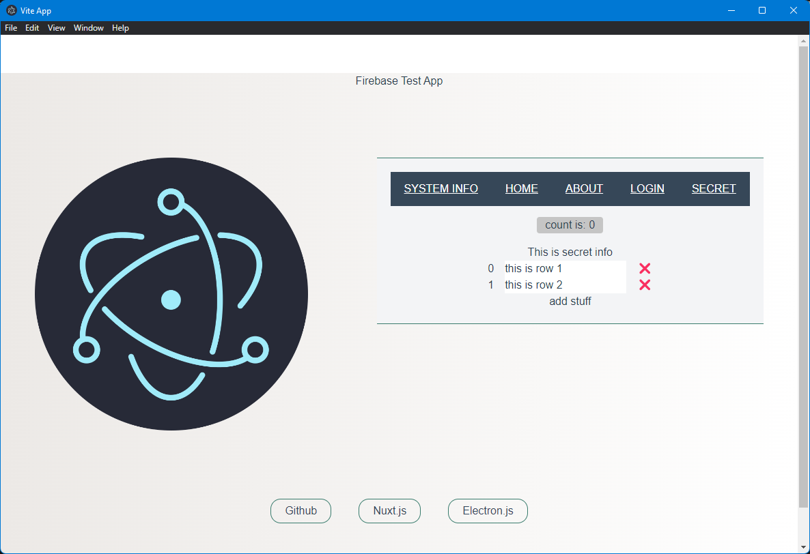

# Vite+Vue3+Electron+Typescript template



## Get Started

### 1. clone this repository

```bash
git clone https://github.com/meadowsjared/geo-mud-report.git
```

### 2. install packages

```bash
pnpm i
```

### 3. Run

### dev mode

```bash
pnpm dev  
```

### preview mode

```bash
pnpm app:preview  
```

### build app

```bash
pnpm app:build
```