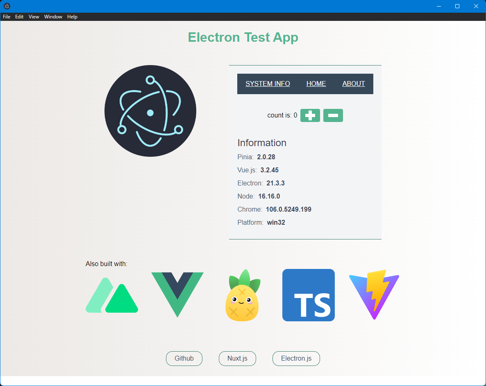

# Vite+Vue3+Electron+Typescript template



## Get Started

### 1. clone this repository

```bash
git clone https://github.com/meadowsjared/nuxt3-electron-ts-template.git
```

### 2. install packages

```bash
pnpm i
```

### 3. Generate the nuxt configuration
```bash
pnpm nuxt:generate
```

### 4. Run

### dev mode

```bash
pnpm dev  
```

### preview mode

```bash
pnpm preview  
```

### build app

```bash
pnpm build
```